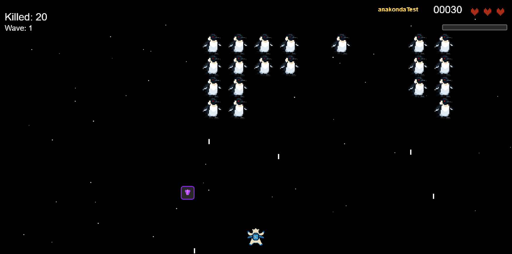

# Space Invaders - Lodis Edition 🐧

A classic Space Invaders browser game inspired by **LODIS (Polish esports team)** 
- Works on desktop and mobile, 
- built with **p5.js** as a Progressive Web App.

🎮 **Play the game here!** https://apanowiczadrian.github.io/galaga



---

## 📦 Installation

The game requires no Node.js or installations - just a local HTTP server:

**Python 3:**
```bash
python -m http.server 8000
```

**Node.js (optional):**
```bash
npm install -g http-server  // install server
git clone https://github.com/apanowiczadrian/galaga.git
cd galaga/
http-server -p 8080         // run server
```

Then open `http://localhost:8080` in your browser.

---

## 🎮 Game Rules

### Controls

**Desktop:**
- `Arrow ← →` - move left/right   
- `Space` - shoot
- `D` - dev overlay (statistics)
- `G` - god mode (invincibility)
- `+` - increase wave (endless mode)
- `-` - decrease wave (endless mode)

**Mobile:**
- Left side of screen - move left and right
- Right side of screen - shoot

### Scoring and Levels

- **Base points:** 1 point per enemy (+1 point every 2 waves)
- **Boss:** 10x more points than regular enemy
- **Comets:** 10-30 points (depending on size)

**Waves (Endless Mode):**
- Each wave increases difficulty
- **Wave 1-10:** Enemies have 1 HP, Boss 5 HP
- **Wave 11-20:** Enemies 2 HP, Boss 10 HP
- **Wave 21-30:** Enemies 3 HP, Boss 15 HP
- Enemies shoot more frequently each wave (+15% per wave)
- Comets appear more often at higher levels

### Power-ups

- **❤️ Life:** +1 life (max 3)
- **🛡️ Shield:** Shield for 1 hit
- **🔥 Auto-fire:** Automatic fire for 4 seconds
- **3️⃣ Triple Shot:** Triple shot for 5 seconds
- **🚀 Rocket:** Destroys all enemies and comets on screen

**Drop chances:**
- Enemies: 3% (Life), 5% (Shield, Auto-fire, Triple Shot, Rocket)
- Comets: 5-10% (Rocket, depending on size)

### Weapon Mechanics

- **Freezing:** The more you shoot, the colder the weapon gets
- **Color:** Green (warm) → Yellow → Blue (FROZEN)
- When the weapon is frozen, you can't shoot for a short time

---

## 📄 License

MIT License - Copyright (c) 2025 Adrian Apanowicz
